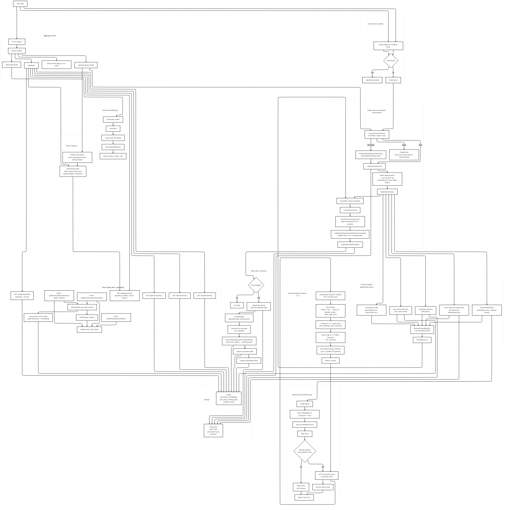

[English](README.md) | [简体中文](README.zh-CN.md)

# TimeLayer

**TimeLayer** is a **local-first** personal AI system that focuses on **long-term conversation continuity** and **auditable memory**.

It’s built around one simple idea:

> Keep an append-only timeline of what happened, then build higher-level memory layers (daily/weekly/monthly + structured facts) on top of it — all reconstructible.

---

## What you get

### 1) Local, auditable memory (no “mystery state”)
- **Append-only raw timeline** (`logs/*.jsonl`): every user/assistant line is stored.
- **Time-layered summaries** (`*.daily.json`, `*.weekly.json`, `*.monthly.json`): compress history over time.
- **Structured facts with workflow**: `pending → remember/reject → conflict → history`.

### 2) Retrieval you can debug
- **Semantic search** over your own memory (summaries + facts).
- Optional **rerank** stage (HTTP call) with an explicit *intent gate* to avoid negative utility.
- **Context audit endpoint**: see exactly which blocks were injected into the prompt and why.

### 3) Two entry surfaces
- **CLI** (`cmd/local-ai`): stdin chat + slash commands
- **Web UI** (`cmd/local-ai-web`): browser chat (SSE streaming) + Facts Center + Context Audit

---

## Architecture overview (Mermaid)

> Note: the diagram keeps some historical naming (e.g. “Gin”), while the current implementation uses Go `net/http` + `http.ServeMux`.  
> Also, “summaries/*.json” in the diagram is a *logical layer* — the current implementation writes summary JSON files under `logs/` (see “Storage layout”).


---

## Core concepts

### Timeline (append-only)
- Raw chat lines are written to `~/local-ai/logs/YYYY-MM-DD.jsonl`.
- This file is the **source of truth**. Everything else can be rebuilt from it.

### Time-layered summaries
- **Daily** summary: derived from today’s `jsonl` timeline.
- **Weekly** summary: derived from daily summaries.
- **Monthly** summary: derived from weekly summaries.

Each summary is stored twice:
1) As a JSON file (`logs/<period>.daily.json`, etc.) for human inspection / backup.
2) In SQLite (`summaries` table) for retrieval & embedding indexing.

### Facts Center (human-in-the-loop memory)
Facts are treated as *structured, controlled memory*, not free-form chat:

- `pending_facts`: candidates that are **proposed** (from explicit “remember” intents, or from summaries).
- `user_facts`: facts that are **active** and used in context injection.
- `conflicts`: when a new fact contradicts an existing active fact for the same subject/key.
- `user_fact_history`: full audit trail of remember/reject/forget/resolve operations.

This lets you keep long-term state **stable, reviewable, and reversible**.

---

## Data flow (one chat turn)

A single chat turn follows this sequence (high-level):

1) **Parse intent** from the user input  
   - `remember / forget / none`
2) **Write raw user line** to JSONL (append-only)
3) **Build system prompt** (includes safety rules and output constraints)
4) **Build context (BuildChatContext)**  
   - active facts
   - daily summary
   - retrieval hits (SearchWithScore)
   - recent raw dialog tail (RecentMaxLines)
5) **LLM call** (streaming for Web; once for CLI)
6) **Sanitize output** (strip internal “remembered …” artifacts if present)
7) **Write assistant line** to JSONL (append-only)
8) **Optional implicit pending proposal** (heuristic: user+assistant pair can propose a pending fact)

---

## Retrieval pipeline (SearchWithScore)

Search is **purely over your own persisted memory**:

1) Embed the query via `TIMELAYER_EMBED_URL` (POST `{"input": "..."}`)
2) Scan all stored embedding vectors (`embeddings` joined to `summaries`)
3) Compute cosine similarity, filter by:
   - `SearchMinScore` (default `0.75`)
4) Sort by embedding score
5) Take top-N candidates (`RerankTopN`, default `20`)
6) **Optional rerank** (precision pass, gated to keep latency down):
   - Enabled when `EnableRerank=true`
   - Hard override (testing/benchmarking): `TIMELAYER_RERANK_FORCE=1` (rerank whenever there are ≥2 hits)
   - Minimum candidate set: `len(hits) >= RerankMinBatch`
   - Gate mode: `TIMELAYER_RERANK_MODE=conservative|ambiguous|smart|always` (default `smart`)
     - `conservative`: rerank only when embedding already has a clear winner
       - `top1 >= SearchMinStrong` **and** `(top1-top2) >= SearchMinGap`
     - `ambiguous`: rerank when embedding is *unsure* (top-2 are close)
       - `top1 >= SearchMinStrong` **and** `(top1-top2) < SearchMinGap` (and top2 is not too weak)
     - `smart`: rerank whenever the query looks strong enough
       - `top1 >= SearchMinStrong`
     - `always`: rerank whenever there are enough candidates (still requires `EnableRerank=true`)

   ⚠️ Note: the gate only sees **indexed content** (summaries + active facts in SQLite). A newly typed `/remember ...` is stored as **pending** first, and won’t affect retrieval until you click “Remember” (or rollup promotes it). If you test immediately, you may match older items and see a small gap.
7) Return top-K (`SearchTopK`, default `5`)

This design keeps rerank as a **precision enhancer**, not a mandatory dependency.

---

## Storage layout

Default base directory: `~/local-ai/`

```
~/local-ai/
├── logs/
│   ├── 2026-01-11.jsonl            # raw timeline (append-only)
│   ├── 2026-01-11.daily.json       # daily summary
│   ├── 2026-W02.weekly.json        # weekly summary (example)
│   ├── 2026-01.monthly.json        # monthly summary (example)
│   └── archive/                    # rotated/archived timelines
├── prompts/                        # prompt templates (daily/weekly/monthly)
└── memory/
    └── memory.sqlite               # structured memory + embeddings
```

---

## Project structure (code)

Top-level:
- `cmd/local-ai/` — CLI entrypoint
- `cmd/local-ai-web/` — Web server entrypoint
- `internal/app/` — core engine (all business logic)
  - `web_server.go` — HTTP API + embedded Web UI (`internal/app/web/*`)
  - `http_middleware.go` — auth token check, loopback bypass, rate-limit, streaming guards
  - `chat*.go` — chat orchestration, prompt assembly, context building, auditing
  - `summary_*.go` — daily/weekly/monthly summary generators
  - `search.go` — semantic search + rerank intent gate
  - `pending_facts*.go` / `facts*.go` — Facts Center workflow and conflict handling
  - `db*.go` — SQLite schema + migrations + helpers

- `tools/rerank-http/` — optional C++ ONNX Runtime reranker server (`POST /v1/rerank`)
- `tools/rerank-proxy/` — optional Python FastAPI proxy: text → tokens → `rerank-http` (`POST /v1/rerank_text`)

---

## External dependencies (runtime)

TimeLayer does not ship a model — it **calls your services via HTTP**:

- **Chat** endpoint (`TIMELAYER_CHAT_URL`)  
  Must be OpenAI-compatible *chat completion* with streaming support for Web.
- **Embedding** endpoint (`TIMELAYER_EMBED_URL`)  
  Accepts `POST {"input": "..."}`
- **Optional rerank** endpoint (`TIMELAYER_RERANK_URL`)  
  If enabled, used for reranking candidate hits.


### Recommended: local LLM + embeddings with llama.cpp (`llama-server`)

If you run everything locally, `llama-server` can expose an OpenAI-compatible chat endpoint **and** an embedding endpoint.

Example (adjust model path and flags to your GPU/CPU):

```bash
# Chat + embeddings on :8080 (provides /v1/chat/completions and /embedding on recent llama.cpp builds)
llama-server \
  -m /path/to/Qwen3-8B-Q5_K_M.gguf \
  --port 8080 \
  --ctx-size 8192 \
  --embedding --pooling cls

export TIMELAYER_CHAT_URL='http://127.0.0.1:8080/v1/chat/completions'
export TIMELAYER_EMBED_URL='http://127.0.0.1:8080/embedding'
export TIMELAYER_CHAT_MODEL='Qwen3-8B-Q5_K_M.gguf'
```

> If your embedding endpoint is `/v1/embeddings` instead of `/embedding`, just set `TIMELAYER_EMBED_URL` accordingly.

### Optional: high-quality rerank (bge-reranker via ONNX Runtime)

This repo includes a full local rerank stack under `tools/`:

- `tools/rerank-http` (C++): runs the ONNX model and exposes `POST /v1/rerank`
- `tools/rerank-proxy` (Python): tokenizes text and exposes `POST /v1/rerank_text` (what TimeLayer calls)

Quickstart (macOS/Linux, requires ONNX Runtime C++ SDK for your platform):

```bash
# 1) Build & run C++ rerank-http
export ORT_ROOT=/path/to/onnxruntime-<platform>-1.23.2
cmake -S tools/rerank-http -B build/rerank-http
cmake --build build/rerank-http -j

./build/rerank-http/rerank_http \
  --ep cpu \
  --model /path/to/model_fp16.onnx
# listens on http://127.0.0.1:8089 by default

# 2) Run Python rerank-proxy
python -m venv .venv && source .venv/bin/activate
pip install -r tools/rerank-proxy/requirements.txt

export RERANK_TOKENIZER_DIR=/path/to/tokenizer_dir
export CPP_RERANK_URL='http://127.0.0.1:8089/v1/rerank'
python tools/rerank-proxy/rerank_proxy.py
# listens on http://127.0.0.1:8090 by default

# 3) Point TimeLayer at the proxy
export TIMELAYER_ENABLE_RERANK=1
export TIMELAYER_RERANK_URL='http://127.0.0.1:8090/v1/rerank_text'
```

If you don’t want rerank, disable it:

```bash
export TIMELAYER_ENABLE_RERANK=0
```

### Rerank gate (why you may see `RERANK SKIPPED`)

TimeLayer intentionally **does not rerank every query**. Rerank is a cross-encoder pass: higher precision, higher latency.

The gate runs on the **embedding-stage scores** (cosine) of the current candidate set and is configurable via `TIMELAYER_RERANK_MODE`:

- `conservative`: rerank only when embedding already has a clear winner
- `ambiguous`: rerank when embedding is *unsure* (top-2 are close)
- `smart` (default): rerank whenever the query looks strong enough (top1 ≥ `TIMELAYER_SEARCH_MIN_STRONG`)
- `always`: rerank whenever there are enough candidates (still gated by `TIMELAYER_RERANK_MIN_BATCH`)

Common skip reasons:

- `weak_query`: top1 is below `TIMELAYER_SEARCH_MIN_STRONG`
- `not_enough_hits`: fewer than `TIMELAYER_RERANK_MIN_BATCH` hits
- `gap_too_small`: **only in `conservative` mode** (top-2 are too close)
- `gap_too_large`: **only in `ambiguous` mode** (embedding is already confident)

Tip: for many embedding models, the top-2 cosine scores are often close, so `conservative` can be *very* strict. If you want rerank to reflect its “disambiguation” nature, try `TIMELAYER_RERANK_MODE=ambiguous`.

### Force rerank (recommended for testing / benchmarking)

To make **any query** rerank whenever there are ≥2 candidates:

```bash
export TIMELAYER_ENABLE_RERANK=1
export TIMELAYER_RERANK_FORCE=1
```

### Make rerank easier to trigger (without clearing your database)

If you want rerank to run more often in a large corpus, lower the gate thresholds:

```bash
# Common “always rerank unless only 0/1 hit” tuning:
export TIMELAYER_SEARCH_MIN_STRONG=0.0
export TIMELAYER_SEARCH_MIN_GAP=0.0
```

Or keep it conservative but less strict:

```bash
export TIMELAYER_SEARCH_MIN_STRONG=0.85
export TIMELAYER_SEARCH_MIN_GAP=0.02
```

### One-message way to trigger rerank without changing code

If you prefer to keep the gate on but still want a single query that tends to pass it, use a **very specific** query that creates a clear top-1 winner.

Practical pattern:

1) First write a unique, specific fact (via chat, so it goes into your timeline):

```
/remember My unique anchor: "TimeLayer rerank smoke-test 2026-01-11 21:58:13".
```

2) Then ask a question that repeats the anchor nearly verbatim:

```
What is my unique anchor "TimeLayer rerank smoke-test 2026-01-11 21:58:13"?
```

This tends to push the top1 embedding score higher and widen the gap, which makes the gate pass more reliably.

---

## Configuration (environment variables)

Defaults are defined in `internal/app/config.go`. Common knobs:

| Env | Default | Meaning |
|---|---:|---|
| `TIMELAYER_CHAT_URL` | `http://localhost:8080/v1/chat/completions` | Chat completion endpoint (OpenAI-compatible). |
| `TIMELAYER_EMBED_URL` | `http://localhost:8080/embedding` | Embedding endpoint. |
| `TIMELAYER_CHAT_MODEL` | `Qwen3-8B-Q5_K_M.gguf` | Sent as the model name in chat requests. |
| `TIMELAYER_HTTP_ADDR` | `127.0.0.1:3210` | Web listen addr. |
| `TIMELAYER_HTTP_AUTH_TOKEN` | empty | If set: `/api/*` requires token (see Security). |
| `TIMELAYER_HTTP_ALLOW_INSECURE_REMOTE` | `false` | Allow binding to non-loopback without token (not recommended). |
| `TIMELAYER_HTTP_RATE_LIMIT_RPM` | `120` | Simple per-IP RPM for `/api/*` (0 disables). |
| `TIMELAYER_HTTP_MAX_CONCURRENT_STREAMS` | `4` | Limit concurrent `/api/chat/stream` sessions. |
| `TIMELAYER_HTTP_MAX_INPUT_BYTES` | `65536` | Max request input size. |
| `TIMELAYER_RECENT_MAX_LINES` | `20` | Tail lines injected as “recent raw dialog”. |
| `TIMELAYER_ENABLE_RERANK` | `true` | Enable rerank stage. |
| `TIMELAYER_RERANK_FORCE` | `false` | Force rerank whenever there are ≥2 candidates (testing/benchmarking). |
| `TIMELAYER_RERANK_MODE` | `smart` | `conservative` (clear-winner), `ambiguous` (near-tie), `smart` (if strong), `always` (if enough hits). |
| `TIMELAYER_RERANK_URL` | `http://127.0.0.1:8090/v1/rerank_text` | Rerank endpoint. |
| `TIMELAYER_RERANK_TOPN` | `20` | Candidate pool size before rerank. |
| `TIMELAYER_RERANK_TIMEOUT_MS` | `15000` | Per rerank request timeout. |
| `TIMELAYER_RERANK_MIN_BATCH` | `2` | Skip rerank if fewer hits. |
| `TIMELAYER_SEARCH_MIN_STRONG` | `0.90` | Gate threshold for rerank modes: top1 embedding score must be ≥ this value (except `always`). |
| `TIMELAYER_SEARCH_MIN_GAP` | `0.06` | Gap threshold used by `conservative` / `ambiguous` (see `TIMELAYER_RERANK_MODE`). |
| `TIMELAYER_SQLITE_JOURNAL_MODE` | `WAL` | SQLite journal mode. |
| `TIMELAYER_SQLITE_SYNCHRONOUS` | `NORMAL` | SQLite synchronous level. |

---

## Security model (production defaults)

### Safe-by-default binding guard
If you try to bind to a non-loopback address (e.g. `0.0.0.0:3210` or LAN IP):
- TimeLayer **refuses to start** unless you either:
  - set `TIMELAYER_HTTP_AUTH_TOKEN`, or
  - explicitly allow insecure remote bind: `TIMELAYER_HTTP_ALLOW_INSECURE_REMOTE=1` (not recommended)

### Token auth
When `TIMELAYER_HTTP_AUTH_TOKEN` is set:
- all `/api/*` require either:
  - `X-Auth-Token: <token>` or
  - `Authorization: Bearer <token>`

### Loopback bypass ("protect others, not yourself")
Requests coming from `127.0.0.1` / `::1` can access `/api/*` **without** a token, **unless** proxy-forwarding headers are present:
- `Forwarded`, `X-Forwarded-For`, `X-Real-IP`, `X-Forwarded-Proto`

This prevents accidental exposure behind a reverse proxy.

---

## How to run

### CLI
```bash
go run ./cmd/local-ai
```

Common commands:
- `/chat <message>`
- `/ask <question>`
- `/search <query>`
- `/daily` / `/weekly` / `/monthly`
- `/remember <fact>`
- `/forget <fact>`
- `/reindex daily|weekly|monthly|all`

### Web UI
```bash
go run ./cmd/local-ai-web
# then open http://127.0.0.1:3210/
```

---

## HTTP API (selected)

### Health
- `GET /health` → `ok`

### Chat (non-stream)
- `POST /api/chat`  
  Body: `{"input":"hello"}`  
  Response: `{"text":"..."}`

### Chat (SSE stream)
- `POST /api/chat/stream`  
  Body: `{"input":"hello"}`  
  SSE events: `delta`, `done`, `error`, `notice` (see `internal/app/web/app.js` for client behavior).

### Context audit
- `POST /api/context/audit` (alias of `/api/debug/context`)  
  Body: `{"input":"..."}`  
  Response: includes injected blocks, steps, and retrieval hits.

### Facts Center (high level)
- counts: `GET /api/facts/counts` (alias of `/api/facts/status/counts`)
- pending list: `GET /api/facts/pending`
- pending groups: `GET /api/facts/pending/groups`
- remember/reject:
  - JSON body: `POST /api/facts/remember` / `POST /api/facts/reject` (`{"id":123}`)
  - REST alias: `POST /api/facts/pending/123/remember` / `.../reject`
- conflicts:
  - `GET /api/facts/conflicts`
  - resolve (JSON body): `POST /api/facts/conflicts/keep` or `/replace`
  - resolve (REST): `POST /api/facts/conflicts/123/resolve` with `{"action":"keep"}` or `{"action":"replace","replacement":"..."}`

---

## Known limitations

- Single-user, local-first design (no user auth/multi-tenant model).
- No HTTPS/TLS built-in (put it behind your own proxy if needed).
- Rerank is optional and best-effort; failures do not break chat.
- Embedding schema assumes consistent embedding dimensionality across time (mixed embedding models should be reindexed).

---

## Operational note

If you plan to expose it to a network, keep token auth enabled and add network controls (firewall / SSH tunnel / reverse proxy with TLS).


## License

GPL-3.0-only. See `LICENSE`.
