[简体中文](README.zh-CN.md) | [English](README.md)

# TimeLayer（时间分层记忆的本地 AI 对话系统）

**TimeLayer** 是一个 **local-first（本地优先）** 的个人 AI 对话系统，核心目标是：  
在保持“像聊天一样自然”的同时，让长期记忆 **可控、可审计、可重建**。

它的设计哲学很直接：

> 先把一切写进时间轴（append-only timeline），再在其上构建更高层的记忆层（daily/weekly/monthly + 结构化事实库）。

---

## 你能得到什么

### 1）本地、可审计的长期记忆（不靠“黑盒状态”）
- **原始时间轴**：`logs/*.jsonl` 逐行追加记录用户/助手对话
- **分层摘要**：`*.daily.json / *.weekly.json / *.monthly.json` 逐步压缩历史
- **结构化事实库 + 工作流**：`pending → remember/reject → conflict → history`

### 2）可调试的检索与注入
- 对摘要与事实做 **语义检索（embedding）**
- 可选 **rerank（HTTP 调用）**，并通过 *意图门控* 避免“越重排越差”
- **上下文审计接口**：完整看到本次 prompt 注入了哪些块、为什么注入

### 3）两种入口，一套引擎
- **CLI**（`cmd/local-ai`）：stdin 聊天 + 斜杠命令
- **Web UI**（`cmd/local-ai-web`）：浏览器聊天（SSE 流式）+ Facts Center + Context Audit

---

## 架构总览（Mermaid）

> 说明：图里保留了历史命名（例如 “Gin HTTP”），但当前实现实际使用 Go `net/http` + `http.ServeMux`。  
> 同时，图里的 “summaries/*.json” 是**逻辑层**概念；当前实现把摘要 JSON 文件写在 `logs/` 下（见「存储布局」）。

```mermaid
---
config:
  theme: neo
  layout: elk
---

flowchart TB
subgraph CLI[" "]
direction TB
CLI_T["命令行 (stdin)<br><br>"]
CLI_PAD["&nbsp;&nbsp;&nbsp;&nbsp;&nbsp;&nbsp;&nbsp;&nbsp;&nbsp;&nbsp;&nbsp;&nbsp;&nbsp;&nbsp;&nbsp;&nbsp;&nbsp;&nbsp;&nbsp;&nbsp;&nbsp;&nbsp;&nbsp;&nbsp;&nbsp;&nbsp;&nbsp;&nbsp;&nbsp;&nbsp;&nbsp;&nbsp;&nbsp;&nbsp;"]
CLI_IN["读取单行输入 / 多行 fence 输入"]
CLI_SLASH{"/ 命令?"}
CLI_CMD["handleCommand()"]
CLI_CHAT["Chat() 入口"]
end

subgraph WEB["WEB (Gin HTTP)"]
HTTP_REQ["HTTP 请求"]
HTTP_ROUTER["路由处理器"]
WEB_CHAT["/api/chat/stream (SSE)"]
WEB_AUDIT["/api/context/audit"]
WEB_FACTS["/api/facts/*"]
WEB_STATIC["静态资源 (app.js / css / html)"]
end

subgraph CHAT_TURN_BOX[" "]
direction TB
CHAT_T["单次对话回合 (长期对话)<br><br>"]
CHAT_PAD["&nbsp;&nbsp;&nbsp;&nbsp;&nbsp;&nbsp;&nbsp;&nbsp;&nbsp;&nbsp;&nbsp;&nbsp;&nbsp;&nbsp;&nbsp;&nbsp;&nbsp;&nbsp;&nbsp;&nbsp;&nbsp;&nbsp;&nbsp;&nbsp;&nbsp;&nbsp;&nbsp;&nbsp;&nbsp;&nbsp;&nbsp;&nbsp;&nbsp;&nbsp;"]
INTENT["ParseAutoFactsIntent()<br>remember / forget / none"]
REM_OP["ProposePendingRememberFact()<br>(写入/更新 pending_facts)"]
FORGET_OP["ForgetFact()<br>(标记 user_facts inactive + 记录历史)"]
LWU["LogWriter.WriteUser()"]
SYS["构建 system prompt<br>(+ 规则：用户可见输出里不要说 'remembered')"]
CTX["BuildChatContext()"]
MSGS["组装上下文 messages"]
STREAM["LLM 流式调用"]
SAN["清洗最终 assistant 文本<br>(若出现 'remembered' 等则剔除)"]
IMPL["maybeAutoProposePendingFromUserInput()<br>(隐式事实：user + assistant 对)"]
LWA["LogWriter.WriteAssistant()"]
end

subgraph CTX_BUILD_BOX[" "]
direction TB
CTX_T["上下文构建 (BuildChatContext)<br><br>"]
CTX_PAD["&nbsp;&nbsp;&nbsp;&nbsp;&nbsp;&nbsp;&nbsp;&nbsp;&nbsp;&nbsp;&nbsp;&nbsp;&nbsp;&nbsp;&nbsp;&nbsp;&nbsp;&nbsp;&nbsp;&nbsp;&nbsp;&nbsp;&nbsp;&nbsp;&nbsp;&nbsp;&nbsp;&nbsp;&nbsp;&nbsp;&nbsp;&nbsp;&nbsp;&nbsp;"]
PVAL["读取策略配置<br>(RecentMaxLines, SearchTopK, 等)"]
F0["读取 active 用户事实<br>(user_facts active)"]
F1["读取 daily summary<br>(filesystem)"]
F2["SearchWithScore()<br>(embedding 扫描 + 可选 rerank)"]
F3["读取最近原始对话行<br>(jsonl tail by RecentMaxLines)"]
RESOLVE["ResolvePromptBlocks()<br>+ 记录 debug STEPS"]
PB["PromptBlock 列表"]
end

subgraph SEARCH_BOX[" "]
direction TB
SEARCH_T["检索 (SearchWithScore)"]
EMB["对 query 做 embedding"]
SCAN["扫描 summaries + facts 的 embeddings"]
SORT1["按 embedding 分数排序"]
TOPN["取 Top N 候选"]
GATE{"启用 Rerank<br>且满足门控条件?"}
SKIP["跳过 rerank<br>(记录 reason)"]
RR_PROXY["HTTP 调用 rerank-proxy<br>(/v1/rerank_text)"]
SORT2["按 rerank 分数排序"]
OUT["返回 Top K 命中"]
end

subgraph RERANK_TOOLS_BOX[" "]
direction TB
RERANK_T["Rerank 工具链（Python + C++）<br><br>"]
RPKG["rerank-proxy (Python / FastAPI)<br>接口：/v1/rerank_text"]
TOK["HF tokenizer<br>(query + doc → input_ids / attention_mask / token_type_ids?)"]
CALL_CPP["转发到 C++ rerank_http<br>CPP_RERANK_URL=/v1/rerank"]
CPP["rerank_http (C++ / ONNXRuntime)<br>接口：/v1/rerank"]
ORT["ORT Session.Run() 推理<br>(CPU / CoreML EP 可选)"]
SCORES["返回 scores[]"]
end

%% =========================
%% AUTOMATION / ACTIONS (默认出计划；低风险可自动)
%% =========================
subgraph ACTIONS_BOX[" "]
direction TB
ACT_T["自动化执行（Actions / Ops Automation）<br><br>"]
ACT_INTENT["ParseActionIntent()<br>plan / dry-run / execute / cancel"]
PLAN["生成可执行计划 (Plan)<br>步骤 + 风险 + 依赖 + 预期结果"]
RISK["风险评估 (Risk Classifier)<br>low / medium / high + 解释"]
POLICY["策略与权限控制<br>allowlist / RBAC / 命名空间隔离 / 速率限制"]
DRY["Dry-run / 预演<br>(kubectl --dry-run=server 等)"]
APPROVE{"需要人工审批/点击执行?"}
UI_APPROVE["人工点击执行 (UI/CLI)<br>approve + execute"]
AUTO_OK{"允许低风险自动执行?"}
EXEC["执行器 (Executor)<br>SSH / K8s / Middleware Clients"]
VERIFY["验证与回读<br>health / logs / metrics / diff"]
ROLLBACK["回滚与补救<br>撤销变更 / 重试 / 降级"]
ACT_AUDIT["审计与追踪<br>操作记录 / 证据 / 可复现命令"]
DENY["阻断/降级为仅计划<br>(返回原因 + 建议)"]
end

subgraph OPS_TARGETS[" "]
direction TB
OPS_T["目标系统（可被自动化操作）<br><br>"]
SSH["Linux/服务器<br>(SSH/SFTP/命令执行)"]
K8S["Kubernetes<br>(API/kubectl/Helm/ArgoCD)"]
MID["中间件<br>(Redis/Kafka/MySQL/ES/Prometheus...)"]
CI["CI/CD & Registry<br>(Git/GitLab/Harbor/Actions)"]
end

subgraph ROLLUP_BOX[" "]
direction TB
ROLLUP_T["每日汇总 / rollup"]
DAY{"日期变化?"}
NOOP["不执行 rollup"]
RU["rollupAndArchive()<br>(归档昨天 logs)"]
DAILY["ensureDaily()<br>(生成 daily summary json)"]
PEND_ING["EnsurePendingFactsFromDailyJSON()<br>(user_facts_explicit → pending_facts)"]
UPS_SUM["Upsert summaries table"]
UPS_EMB["Upsert embeddings table"]
LINT["summary lint 警告<br>(例如 'possibly')"]
end

subgraph FACTS["事实中心（API + 操作）"]
COUNT["GET /api/facts/counts<br>(pending / conflicts / active / history)"]
LP["GET /api/facts/pending<br>(grouped + scored)"]
LC["GET /api/facts/conflicts"]
LA["GET /api/facts/active"]
LH["GET /api/facts/history"]
REMEMBER["POST /api/facts/pending/:id/remember"]
REJECT["POST /api/facts/pending/:id/reject"]
RESOLVE_CF["POST /api/facts/conflicts/:id/resolve<br>(keep / replace)"]
UF["写入/更新 user_facts (active)"]
CF["写入/更新 conflicts"]
HIST["追加 user_fact_history"]
SYNC["同步 facts 到检索索引<br>(upsertSummary + embedding)"]
end

subgraph AUDIT_BOX[" "]
direction TB
AUDIT_T["上下文审计 (Debug)"]
A1["读取策略值"]
A2["读取 facts"]
A3["读取 recent raw dialog"]
A4["运行 SearchWithScore"]
A5["返回 blocks + steps + hits"]
end

subgraph STORE_BOX[" "]
direction TB
STORE_T["存储<br><br>"]
STORE_PAD["&nbsp;&nbsp;&nbsp;&nbsp;&nbsp;&nbsp;&nbsp;&nbsp;&nbsp;&nbsp;&nbsp;&nbsp;&nbsp;&nbsp;&nbsp;&nbsp;&nbsp;&nbsp;&nbsp;&nbsp;&nbsp;&nbsp;&nbsp;&nbsp;&nbsp;&nbsp;&nbsp;&nbsp;&nbsp;&nbsp;&nbsp;&nbsp;&nbsp;&nbsp;"]
FS["文件系统<br>logs/*.jsonl<br>summaries/*.json<br>archives/*"]
DB["SQLite<br>summaries, embeddings,<br>user_facts, pending_facts,<br>conflicts, history"]
end

subgraph UI_BOX[" "]
direction TB
UI_T["Web UI (app.js)"]
UI_STREAM["渲染 SSE tokens<br>(流式时剥离 'remembered' 前缀)"]
UI_REFRESH["fetchFactCounts()<br>(stream & facts 操作后)<br>(更新徽标/状态)"]
UI_ACTIONS["Actions 面板<br>计划预览 / Dry-run / 点击执行 / 回滚 / 证据"]
end

%% ===== Core wiring =====
CLI_T ~~~ CLI_PAD
CLI_PAD ~~~ CLI_IN

U["用户输入"] --> CLI_IN & CLI_IN & HTTP_REQ

CLI_IN --> CLI_SLASH & CLI_SLASH
CLI_SLASH -- 是 --> CLI_CMD
CLI_SLASH -- 否 --> CLI_CHAT

HTTP_REQ --> HTTP_ROUTER
HTTP_ROUTER --> WEB_CHAT & WEB_AUDIT & WEB_FACTS & WEB_STATIC

CHAT_T ~~~ CHAT_PAD
CHAT_PAD ~~~ INTENT

INTENT -- remember --> REM_OP
REM_OP --> LWU
INTENT -- forget --> FORGET_OP
INTENT -- none --> LWU

LWU --> SYS & FS
SYS --> CTX
CTX --> MSGS & PVAL & F0 & F1 & F2 & F3

MSGS --> STREAM
STREAM --> SAN
SAN --> IMPL
IMPL --> LWA

CLI_CHAT --> INTENT
WEB_CHAT --> INTENT & UI_STREAM

CTX_T ~~~ CTX_PAD
CTX_PAD ~~~ PVAL

PVAL --> RESOLVE
F0 --> RESOLVE & DB
F1 --> RESOLVE & FS
F2 --> RESOLVE & EMB
F3 --> RESOLVE & FS

RESOLVE --> PB
PB --> MSGS

SEARCH_T ~~~ EMB
EMB --> SCAN
SCAN --> SORT1
SORT1 --> TOPN
TOPN --> GATE
GATE -- 否 --> SKIP
SKIP --> OUT
GATE -- 是 --> RR_PROXY
RR_PROXY --> SORT2
SORT2 --> OUT

%% Rerank toolchain wiring
RR_PROXY --> RPKG
RPKG --> TOK
TOK --> CALL_CPP
CALL_CPP --> CPP
CPP --> ORT
ORT --> SCORES
SCORES --> RR_PROXY

%% ===== Actions: two entry paths =====
CLI_CMD --> ACT_INTENT
HTTP_ROUTER --> UI_ACTIONS
SAN --> ACT_INTENT

%% Default: plan first, always visible
ACT_INTENT --> PLAN
PLAN --> RISK
RISK --> POLICY
POLICY --> DRY
DRY --> UI_ACTIONS

%% Decision: manual by default
DRY --> APPROVE
APPROVE -- 是（默认） --> UI_APPROVE
UI_APPROVE --> EXEC

%% Low risk can auto-execute when explicitly allowed
APPROVE -- 否（仅当 low 风险） --> AUTO_OK
AUTO_OK -- 是（policy 允许） --> EXEC
AUTO_OK -- 否 --> DENY

%% Exec pipeline
EXEC --> VERIFY
VERIFY --> ROLLBACK
EXEC --> ACT_AUDIT
VERIFY --> ACT_AUDIT
ROLLBACK --> ACT_AUDIT
DENY --> ACT_AUDIT

%% Targets
EXEC --> SSH & K8S & MID & CI

%% Persist audits
ACT_AUDIT --> FS & DB

%% Rollup
ROLLUP_T ~~~ DAY
LWA --> DAY & FS
DAY -- 否 --> NOOP
DAY -- 是 --> RU
RU --> DAILY & FS
DAILY --> LINT
LINT --> PEND_ING
PEND_ING --> UPS_SUM & DB
UPS_SUM --> UPS_EMB & DB

%% Facts
WEB_FACTS --> COUNT & LP & LC & LA & LH & UI_REFRESH

REMEMBER --> UF & HIST
UF --> SYNC & CF
REJECT --> HIST
RESOLVE_CF --> UF & HIST
CF --> HIST

%% Audit endpoint
AUDIT_T ~~~ A1
WEB_AUDIT --> A1
A1 --> A2
A2 --> A3
A3 --> A4
A4 --> A5

%% Storage
STORE_T ~~~ STORE_PAD
STORE_PAD ~~~ FS

UPS_EMB --> DB
LP --> DB
LC --> DB
LA --> DB
LH --> DB
SYNC --> DB

%% UI
UI_T ~~~ UI_STREAM
UI_STREAM --> UI_REFRESH
UI_REFRESH --> COUNT

CLI_T:::sgtitle
CLI_PAD:::sgtitle
CHAT_T:::sgtitle
CHAT_PAD:::sgtitle
CTX_T:::sgtitle
CTX_PAD:::sgtitle
SEARCH_T:::sgtitle
RERANK_T:::sgtitle
ACT_T:::sgtitle
OPS_T:::sgtitle
ROLLUP_T:::sgtitle
AUDIT_T:::sgtitle
STORE_T:::sgtitle
STORE_PAD:::sgtitle
UI_T:::sgtitle

classDef sgtitle fill:transparent,stroke:transparent,stroke-width:0px


```



---

## 关键概念（设计层）

### 1）时间轴（append-only）
- 每次对话都会把用户/助手行写入：`~/local-ai/logs/YYYY-MM-DD.jsonl`
- 这是**唯一真相源**。后续的摘要、embedding 索引、事实库都可以基于它重建。

### 2）时间分层摘要（Daily / Weekly / Monthly）
- **Daily**：从当天的 `jsonl` 生成当日摘要  
- **Weekly**：从一周内 daily 摘要生成周摘要  
- **Monthly**：从一个月内 weekly 摘要生成月摘要  

每个摘要会同时落两份：
1) **文件**：`logs/<period>.daily.json` 等，便于肉眼查看/备份/迁移  
2) **SQLite**：写入 `summaries` 表，便于检索与 embedding 索引

### 3）事实中心（Facts Center：人类可控的长期记忆）
事实不是“随便一句话就当成长期记忆”，而是经过工作流管理的结构化记忆：

- `pending_facts`：候选事实（待你确认）
- `user_facts`：已生效事实（会参与 prompt 注入）
- `conflicts`：冲突池（新事实与旧事实在同 subject/key 上矛盾）
- `user_fact_history`：操作审计（remember / reject / forget / resolve 全记录）

这套机制保证：长期记忆 **稳定、不乱漂、可回滚**。

---

## 单次对话（Chat Turn）发生了什么

高层流程如下（与图一致）：

1) **解析用户意图**：`remember / forget / none`
2) **写入用户原始行**（JSONL 追加）
3) **构造 system prompt**（包含规则，例如不在用户可见输出里说“已记住”）
4) **构建上下文（BuildChatContext）**  
   - active facts  
   - 今日 daily summary  
   - 检索命中（SearchWithScore）  
   - 最近对话尾部（RecentMaxLines）  
5) **LLM 调用**（Web 为 streaming；CLI 为一次性）
6) **输出清洗**（例如把内部“remembered …”痕迹去掉）
7) **写入助手原始行**（JSONL 追加）
8) **可选：隐式事实提案**（把“用户 + 助手”的组合抽成候选事实，进 pending）

---

## 检索管线（SearchWithScore）如何工作

检索严格基于你自己的持久化记忆（摘要 + 事实）：

1) 通过 `TIMELAYER_EMBED_URL` 对 query 做 embedding（POST `{"input": "..."}`）
2) 扫描 `embeddings`（与 `summaries` join）计算 cosine 相似度
3) 低于阈值 `SearchMinScore`（默认 `0.75`）直接过滤
4) 按 embedding 分数排序，取候选 top-N（`RerankTopN`）
5) **可选 rerank**（只有门控通过才执行）：
   - `EnableRerank=true`
   - 命中数 ≥ `RerankMinBatch`
   - top1 embedding 足够强（`SearchMinStrong`）
   - top1-top2 gap 足够大（`SearchMinGap`）
6) 最后返回 top-K（`SearchTopK`）

结论：rerank 是“锦上添花”，不是“必须依赖”。失败/超时不会影响系统正常对话（只会跳过 rerank）。

---

## 存储布局（本地文件 + SQLite）

默认 base dir：`~/local-ai/`

```
~/local-ai/
├── logs/
│   ├── 2026-01-11.jsonl            # 原始时间轴（追加写）
│   ├── 2026-01-11.daily.json       # 日摘要
│   ├── 2026-W02.weekly.json        # 周摘要（示例）
│   ├── 2026-01.monthly.json        # 月摘要（示例）
│   └── archive/                    # 归档的旧 jsonl
├── prompts/                        # 摘要/系统提示模板（daily/weekly/monthly）
└── memory/
    └── memory.sqlite               # summaries/embeddings/facts 全部在这里
```

---

## 工程结构（代码模块地图）

顶层：
- `cmd/local-ai/`：CLI 入口
- `cmd/local-ai-web/`：Web 服务入口
- `internal/app/`：核心引擎（所有逻辑都在这里）
  - `web_server.go`：HTTP API + 内嵌 Web UI（`internal/app/web/*`）
  - `http_middleware.go`：token 校验、loopback bypass、限流、stream 并发控制
  - `chat*.go`：聊天编排、prompt 组装、上下文构建、审计输出
  - `summary_*.go`：daily/weekly/monthly 生成器
  - `search.go`：embedding 检索 + rerank 门控
  - `pending_facts*.go` / `facts*.go`：事实工作流、冲突处理、历史记录
  - `db*.go`：SQLite schema / migration / helper

- `tools/rerank-http/`：C++/ONNX Runtime reranker（接收 token id，提供 `/v1/rerank`）
- `tools/rerank-proxy/`：FastAPI 文本代理（tokenize 后调用 rerank-http，对外提供 `/v1/rerank_text`，TimeLayer 直接用它）

---

## 运行时依赖（外部服务）

TimeLayer 本身不内置模型，它通过 HTTP 调你自己的服务：

- **Chat 服务**（`TIMELAYER_CHAT_URL`）  
  需 OpenAI 兼容的 chat completion；Web 需要 streaming（SSE/分块）支持。
- **Embedding 服务**（`TIMELAYER_EMBED_URL`）  
  接收 `POST {"input":"..."}` 并返回 embedding（系统已兼容多种常见返回格式）。
- **可选 rerank 服务**（`TIMELAYER_RERANK_URL`）  
  若启用，则对候选命中做精排。


### 推荐：用 llama.cpp 的 `llama-server` 本地跑 Chat + Embedding

`llama-server` 可以同时提供 chat completions 与 embedding 接口。下面给一组常见启动示例（你可以替换成自己的 GGUF 模型路径）：

```bash
# 例：本地启动（默认提供 /v1/chat/completions 和 /embedding）
llama-server \
  -m /path/to/Qwen3-8B-Q5_K_M.gguf \
  --port 8080 \
  --n-gpu-layers 99 \
  --ctx-size 8192 \
  --embedding --pooling cls

# 然后把 TimeLayer 指向它
export TIMELAYER_CHAT_URL="http://127.0.0.1:8080/v1/chat/completions"
export TIMELAYER_EMBED_URL="http://127.0.0.1:8080/embedding"
export TIMELAYER_CHAT_MODEL="Qwen3-8B-Q5_K_M.gguf"
```

> 不同版本的 llama.cpp 可能提供 `/v1/embeddings` 或 `/embedding`，以你实际服务为准（用 `TIMELAYER_EMBED_URL` 调整即可）。

### 可选：更强 rerank（Python 文本代理 + C++ ONNX 推理）

本仓库提供一套可选的“高质量精排”组件，目录如下：

- `tools/rerank-http`：C++ + ONNX Runtime 的 token-level rerank 服务（`POST /v1/rerank`）
- `tools/rerank-proxy`：FastAPI 文本代理（`POST /v1/rerank_text`），负责 tokenizer，再转发给 rerank-http

最小启动流程：

```bash
# 1) 编译并启动 C++ rerank-http（默认 :8089）
cmake -S tools/rerank-http -B build/rerank-http \
  -DORT_ROOT="/path/to/onnxruntime"
cmake --build build/rerank-http -j

./build/rerank-http/rerank_http \
  --ep cpu \
  --model /path/to/model_fp16.onnx

# 2) 启动 Python rerank-proxy（默认 :8090）
cd tools/rerank-proxy
python -m venv .venv && source .venv/bin/activate
pip install -r requirements.txt

export RERANK_TOKENIZER_DIR="/path/to/tokenizer_dir"
export CPP_RERANK_URL="http://127.0.0.1:8089/v1/rerank"
python rerank_proxy.py

# 3) 让 TimeLayer 指向 rerank-proxy
export TIMELAYER_ENABLE_RERANK=1
export TIMELAYER_RERANK_URL="http://127.0.0.1:8090/v1/rerank_text"
```

如果你暂时不想启用精排：

```bash
export TIMELAYER_ENABLE_RERANK=0
```

### 精排门控（为什么你会看到 `RERANK SKIPPED`）

TimeLayer **不会对每个查询都 rerank**，默认会做门控以控制延迟/成本。

从这个版本开始，你可以用 `TIMELAYER_RERANK_MODE` 指定门控策略：

- `conservative`：只有当 embedding 已经“明显有胜者”才 rerank（top1 足够强且 gap 够大）
- `ambiguous`：当 embedding “分不出胜负”才 rerank（top1 强，但 top1-top2 很接近）
- `smart`（默认）：只要 top1 够强且候选数足够就 rerank（更接近“rerank 的本质”：交叉编码器来做精确排序）
- `always`：只要候选数足够就 rerank（仍需 `TIMELAYER_ENABLE_RERANK=1`；更硬的无条件开关用 `TIMELAYER_RERANK_FORCE=1`）

当你看到类似日志：

```
========== RERANK SKIPPED @ 2026-01-11 21:58:13.736 reason=gap_too_small hits=13 mode=conservative top1=0.8123 top2=0.8099 gap=0.0024 minStrong=0.8000 minGap=0.1200 ==========
```

这表示在当前 **mode** 下门控没通过。

- 如果你经常看到 `gap_too_small`：说明你的 embedding 模型的相似度分布“天然很接近”（gap 很小是常态），建议用：
  - `TIMELAYER_RERANK_MODE=smart`（最省心）
  - 或 `TIMELAYER_RERANK_MODE=ambiguous`（专门处理“打平”的情况）

### 强制 rerank（建议用于测试/对比/压测）

让**任何查询**只要有 ≥2 个候选就 rerank：

```bash
export TIMELAYER_ENABLE_RERANK=1
export TIMELAYER_RERANK_FORCE=1
```

### 不清库也更容易触发 rerank

如果你希望在大语料库里更频繁触发 rerank，可以降低门槛：

```bash
# 常见“只要有命中就 rerank”的测试配置：
export TIMELAYER_SEARCH_MIN_STRONG=0.0
export TIMELAYER_SEARCH_MIN_GAP=0.0
```

或者保持一定保守性，但别太严格：

```bash
export TIMELAYER_SEARCH_MIN_STRONG=0.85
export TIMELAYER_SEARCH_MIN_GAP=0.02
```

### 一条消息触发 rerank（不改代码）

如果你想保留门槛逻辑，但又想“靠一句话更稳地过门槛”，就构造一个**非常具体**、能拉开 top1 优势的查询：

1) 先写入一个很独特的事实（走正常聊天写入 timeline）：

```
/remember My unique anchor: "TimeLayer rerank smoke-test 2026-01-11 21:58:13".
```

2) 再问一句几乎原样重复 anchor 的问题：

```
我之前记住的 unique anchor "TimeLayer rerank smoke-test 2026-01-11 21:58:13" 是什么？
```

这种写法通常能提高 top1 embedding 分数并扩大 gap，从而在 `conservative` 模式下更容易触发精排。

如果你的模型对“数字/UUID/奇怪符号”不敏感，建议 anchor 用**更可语义化的稀有词组合**（例如几个不常见英文词 + 专有名词），更容易拉开差距。

---

## 配置（环境变量）

默认值在 `internal/app/config.go`。常用项如下：

| 环境变量 | 默认值 | 说明 |
|---|---:|---|
| `TIMELAYER_CHAT_URL` | `http://localhost:8080/v1/chat/completions` | 对话模型接口（OpenAI-compatible）。 |
| `TIMELAYER_EMBED_URL` | `http://localhost:8080/embedding` | embedding 接口。 |
| `TIMELAYER_CHAT_MODEL` | `Qwen3-8B-Q5_K_M.gguf` | 作为 `model` 字段发给 chat 服务。 |
| `TIMELAYER_HTTP_ADDR` | `127.0.0.1:3210` | Web 监听地址。 |
| `TIMELAYER_HTTP_AUTH_TOKEN` | 空 | 设定后 `/api/*` 需要 token（见「安全」）。 |
| `TIMELAYER_HTTP_ALLOW_INSECURE_REMOTE` | `false` | 允许无 token 绑定到非 loopback（不建议）。 |
| `TIMELAYER_HTTP_RATE_LIMIT_RPM` | `120` | 简易按 IP 限流（0 关闭）。 |
| `TIMELAYER_HTTP_MAX_CONCURRENT_STREAMS` | `4` | 限制并发 SSE 流。 |
| `TIMELAYER_HTTP_MAX_INPUT_BYTES` | `65536` | 限制输入大小。 |
| `TIMELAYER_RECENT_MAX_LINES` | `20` | 注入最近 raw 对话行数。 |
| `TIMELAYER_ENABLE_RERANK` | `true` | 启用 rerank。 |
| `TIMELAYER_RERANK_FORCE` | `false` | 强制 rerank：只要候选 ≥2 就 rerank（测试/对比/压测）。 |
| `TIMELAYER_RERANK_MODE` | `smart` | `conservative`（明显胜者）, `ambiguous`（打平才精排）, `smart`（强命中就精排）, `always`（够候选就精排）。 |
| `TIMELAYER_RERANK_URL` | `http://127.0.0.1:8090/v1/rerank_text` | rerank 接口。 |
| `TIMELAYER_RERANK_TOPN` | `20` | rerank 候选池大小。 |
| `TIMELAYER_RERANK_TIMEOUT_MS` | `15000` | rerank 超时。 |
| `TIMELAYER_RERANK_MIN_BATCH` | `2` | 命中不足则跳过。 |
| `TIMELAYER_SEARCH_MIN_STRONG` | `0.90` | rerank 门槛：top1 embedding 分数需 ≥ 该值。 |
| `TIMELAYER_SEARCH_MIN_GAP` | `0.06` | rerank 门槛：top1-top2 gap 需 ≥ 该值（再乘内部系数）。 |
| `TIMELAYER_SQLITE_JOURNAL_MODE` | `WAL` | SQLite 日志模式。 |
| `TIMELAYER_SQLITE_SYNCHRONOUS` | `NORMAL` | SQLite 同步等级。 |

---

## 安全模型（生产默认）

### 1）默认拒绝“无鉴权的远程绑定”
当你把监听地址设为非 loopback（例如 `0.0.0.0:3210` / 局域网 IP）时：
- 若没设置 `TIMELAYER_HTTP_AUTH_TOKEN` 且没显式允许不安全远程绑定  
  → **TimeLayer 会拒绝启动**（安全默认）。

### 2）Token 鉴权
当设置 `TIMELAYER_HTTP_AUTH_TOKEN` 后：
- 所有 `/api/*` 需要：
  - `X-Auth-Token: <token>` 或
  - `Authorization: Bearer <token>`

### 3）Loopback bypass（“防别人，不防自己”）
来自 `127.0.0.1` / `::1` 的请求可免 token（方便本机使用），但如果出现代理转发头则不会免除：
- `Forwarded`, `X-Forwarded-For`, `X-Real-IP`, `X-Forwarded-Proto`

这样可以避免你把服务挂到反代后“误以为还是本机请求”。

---

## 如何运行

### CLI
```bash
go run ./cmd/local-ai
```

常用命令：
- `/chat <message>`
- `/ask <question>`（尽量只基于你的历史记录回答）
- `/search <query>`（只看检索命中，不生成回答）
- `/daily` / `/weekly` / `/monthly`
- `/remember <fact>` / `/forget <fact>`
- `/reindex daily|weekly|monthly|all`

### Web UI
```bash
go run ./cmd/local-ai-web
# 浏览器打开 http://127.0.0.1:3210/
```

---

## HTTP API（核心接口）

### 健康检查
- `GET /health` → `ok`

### 非流式对话
- `POST /api/chat`  
  Body：`{"input":"hello"}`  
  Resp：`{"text":"..."}`

### SSE 流式对话
- `POST /api/chat/stream`  
  Body：`{"input":"hello"}`  
  SSE event：`delta / done / error / notice`（客户端实现见 `internal/app/web/app.js`）

### 上下文审计
- `POST /api/context/audit`（`/api/debug/context` 的 alias）  
  Body：`{"input":"..."}`
  Resp：返回注入块、步骤、检索命中等结构信息（用于 Debug / 可视化）。

### Facts Center（概览）
- counts：`GET /api/facts/counts`（alias：`/api/facts/status/counts`）
- pending：`GET /api/facts/pending`
- pending groups：`GET /api/facts/pending/groups`
- remember/reject：
  - JSON：`POST /api/facts/remember` / `/api/facts/reject`（`{"id":123}`）
  - REST：`POST /api/facts/pending/123/remember` / `.../reject`
- conflicts：
  - `GET /api/facts/conflicts`
  - JSON resolve：`POST /api/facts/conflicts/keep` / `/replace`
  - REST resolve：`POST /api/facts/conflicts/123/resolve`，Body：`{"action":"keep"}` 或 `{"action":"replace","replacement":"..."}`

---

## 已知限制（当前取舍）

- 单用户、本地优先（无多租户/用户体系）。
- 不内置 HTTPS/TLS（如需远程使用建议走你自己的反代 + TLS）。
- rerank 为 best-effort：失败/超时不影响主流程。
- embedding 维度假设长期一致：如果换 embedding 模型，建议 `/reindex all`。

---

## 运维建议

如果要上网卡/局域网对外提供：
1) 必开 `TIMELAYER_HTTP_AUTH_TOKEN`
2) 配合防火墙 / SSH tunnel / 反代 TLS
3) 让反代注入 token（客户端无需手动输 token）


## 许可证

GPL-3.0-only，详见 `LICENSE`。
